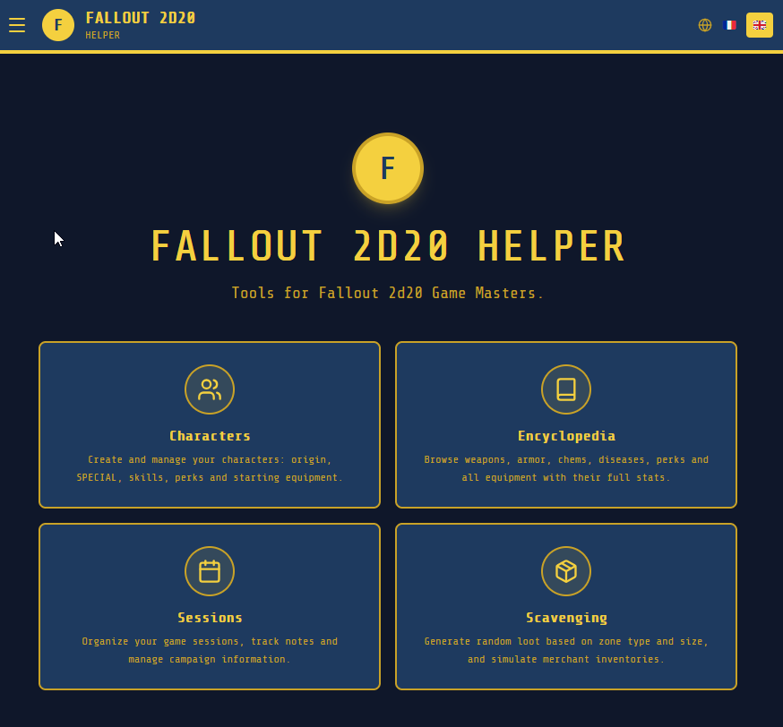
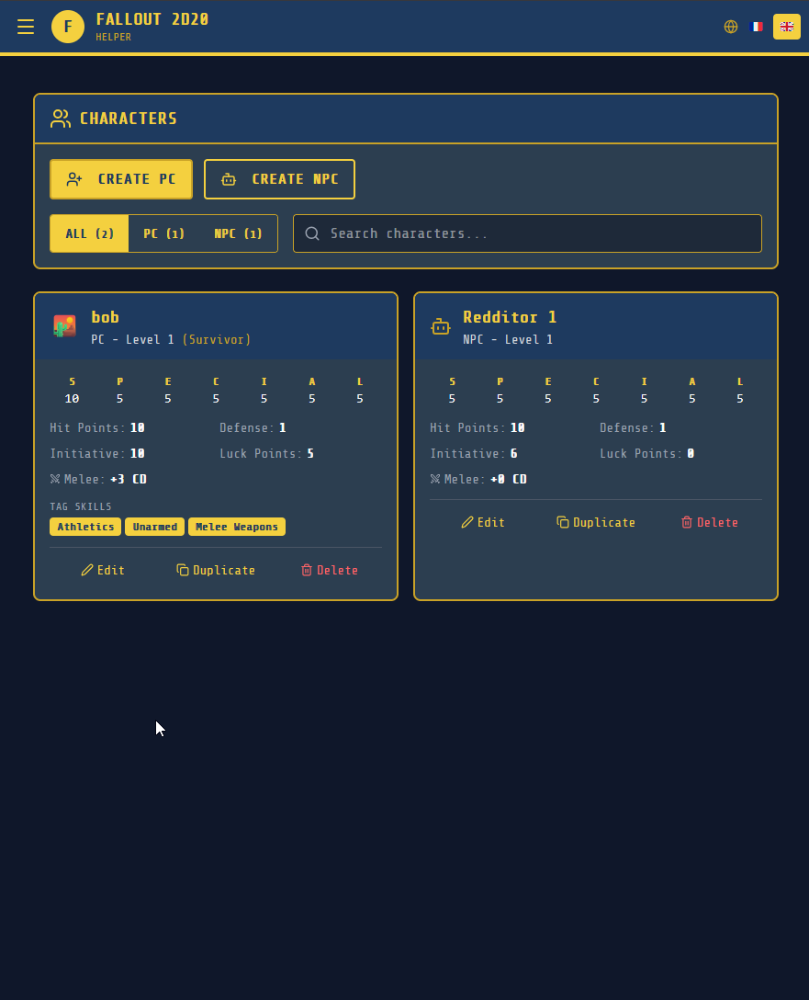
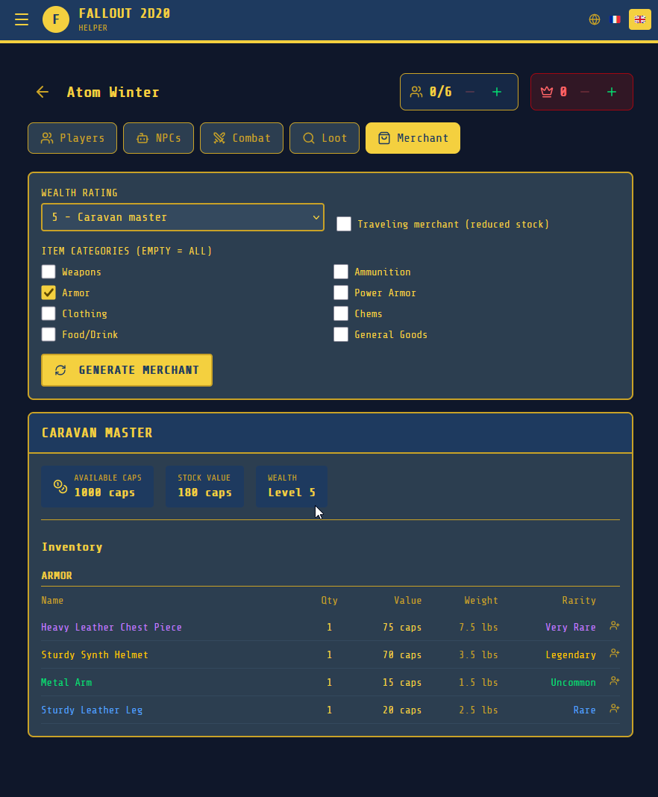
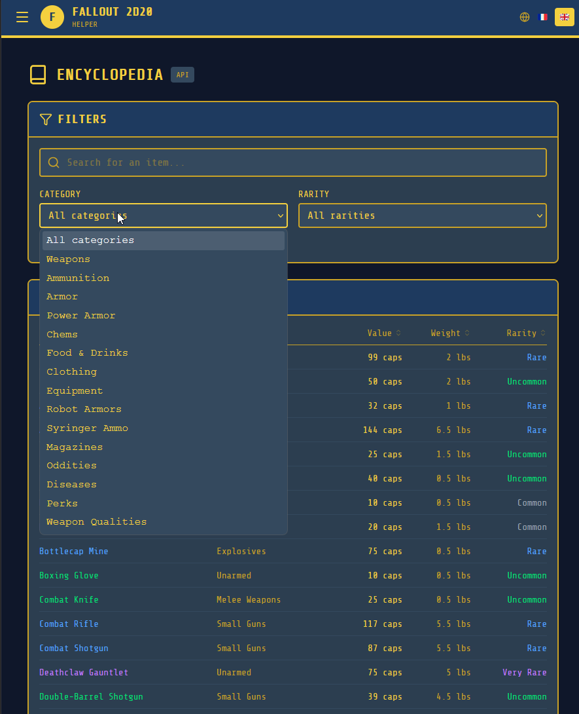
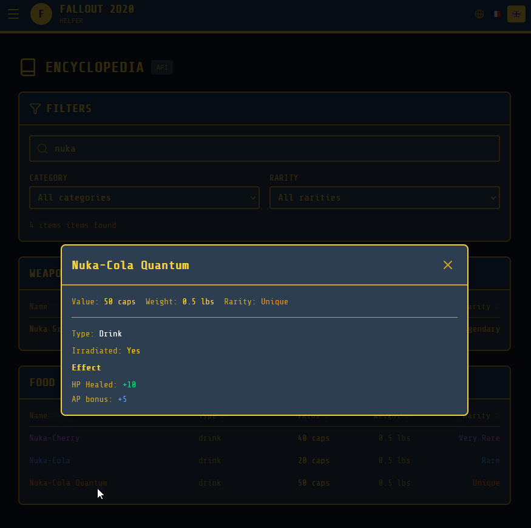
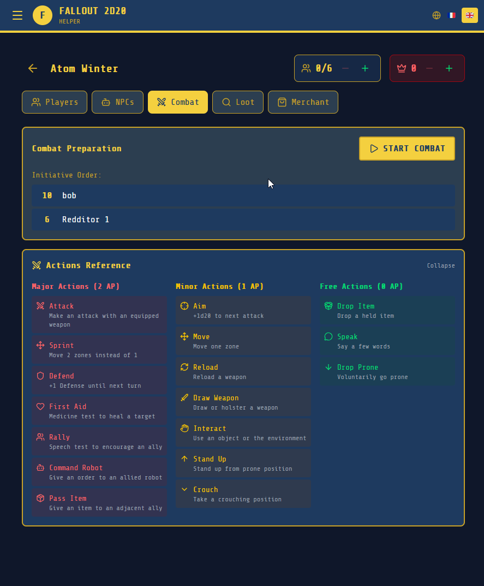

# Fallout 2d20 Helper

A companion web app for the **Fallout 2d20 TTRPG** (by Modiphius Entertainment), designed to help Game Masters and players at the table.

> Built with React + Vite (frontend) and Express + Drizzle ORM + PostgreSQL (backend). Installable as a PWA from the browser.



---

## Features

- **Character creation** — step-by-step wizard: origin, SPECIAL, skills, tag skills, perks, equipment packs
- **Character sheet** — HP, AP, inventory management, body resistance map
- **Session manager** — track multiple sessions, manage participants and action points
- **Dice roller** — 2d20 roll with success/complication counting
- **Loot generator** — generate loot by area type, size and location level
- **Merchant generator** — generate merchant inventory by wealth rating
- **Encyclopedia** — browse all weapons, armor, chems, ammo and other items
- **Bilingual** — French and English UI

---

## Quick Start (Docker — recommended)

The easiest way to run the app. No build required, just pull the official image.

**1. Download the compose file**
```bash
curl -O https://raw.githubusercontent.com/ReynierMatth/fallout2d20-helper/main/docker-compose.yml
```

**2. Start the app**
```bash
docker compose up -d
```

The app is available at [http://localhost:3000](http://localhost:3000).

> On first start, the database is automatically migrated and seeded with all game data.

### Environment variables

| Variable | Default | Description |
|---|---|---|
| `DATABASE_URL` | *(set in compose)* | PostgreSQL connection string |
| `PORT` | `3001` | Backend API port (internal) |
| `NODE_ENV` | `production` | Node environment |

### Change the exposed port

Edit `docker-compose.yml` and change `"3000:80"` to your desired port, e.g. `"8080:80"`.

---

## Build from source

**Requirements:** Node.js 22+, Docker, PostgreSQL

**1. Clone the repo**
```bash
git clone https://github.com/ReynierMatth/fallout2d20-helper.git
cd fallout2d20-helper
```

**2. Build and start**
```bash
docker compose -f docker-compose.yml up -d --build
```

Or run without Docker:

```bash
# Backend
cd back
cp .env.example .env   # edit DATABASE_URL
npm install
npx drizzle-kit migrate
npx tsx src/db/seed/index.ts
npx tsx src/index.ts

# Frontend (separate terminal)
cd front
npm install
npm run dev
```

---


## Tech stack

| Layer | Tech |
|---|---|
| Frontend | React 18, Vite, TypeScript, Tailwind CSS, i18next |
| Backend | Express, Drizzle ORM, PostgreSQL |
| Infra | Docker, nginx, GitHub Actions, GHCR |

---

## License

[MIT](LICENSE)

---

## Screenshots

### Character creation


### PC / NPC list


### Loot generator


### Merchant generator


### Encyclopedia


### Item details


### Session manager


---

> This is an unofficial fan-made tool. Fallout is a trademark of Bethesda Softworks. The Fallout 2d20 system is published by [Modiphius Entertainment](https://www.modiphius.net/).
